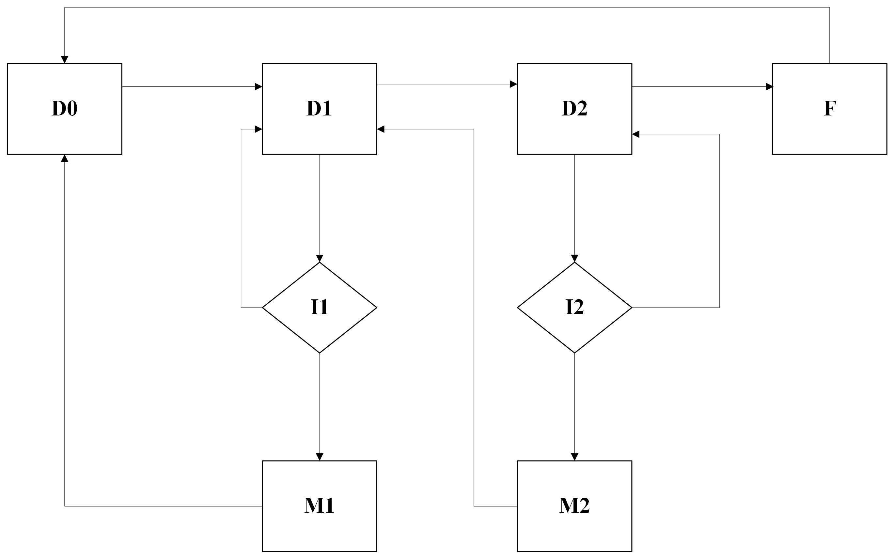

# Evaluating Cost Efficiency of Various Maintenance Strategies for Fleet Management

As part of this educational project on *Reliability of Digital Systems* at ***Wroclaw University of Science and Technology***, under the supervision of [***Dr. hab. Henryk Maciejewski***](https://wit.pwr.edu.pl/wydzial/struktura-organizacyjna/pracownicy/henryk-maciejewski), our team, with me as the leader, focused on generating a dataset that simulates the lifecycle of a vehicle within a courier company's fleet. Our objective was to test various vehicle maintenance policies and to identify the most financially effective approach in selecting these policies.

## Table of contents

- [Project Overview](#project-overview)
- [Simulation](#simulation)
- [Data Handling](#data-handling)
- [Visualization](#visualization)
- [Getting Started](#getting-started)
- [Acknowledgments](#acknowledgments)
- [Contacts](#contacts)

## Project Overview

This project utilizes a Python-based simulation to generate datasets for various predefined maintenance policies of service vehicles. During the simulation, the usage time of vehicles, whether in operation or under maintenance, along with the costs of maintenance, inspections, and vehicle replacements are meticulously recorded. The datasets, generated over simulations of varying durations, are subsequently saved in CSV format. These data are then used for detailed analysis and visualization, employing libraries such as **seaborn**, **matplotlib**, and **pandas** to facilitate in-depth evaluation of the maintenance strategies.

## Simulation



The simulation implemented in this project is based on a Markov chain, comprising four states that depict different stages in the lifecycle of a vehicle:

- **D0 (Degradation level 0)**: The vehicle is new, operating in optimal condition.
- **D1 (Degradation level 1)**: Shows minor signs of wear; inspection is required.
- **D2 (Degradation level 2)**: Significantly worn; inspection is required.
- **F (Failure)**: The vehicle is inoperable and needs replacement.

Transition times between these states are generated randomly, constrained by coefficients specified in the configuration file. Decisions regarding the necessity of repairs during inspections, the duration of inspections, and the length of maintenance interventions are generated in a similar stochastic manner. Following a state transition, corresponding actions are taken based on the new state's requirements — for instance, a vehicle in state D0 continues to operate without need for immediate intervention.

Costs for each inspection, maintenance session, or vehicle replacement are accounted for as per predefined service charges. Vehicles are not operational during inspections, maintenance, or replacement phases, accurately simulating downtime.

To minimize simulation error, the simulation is run multiple times. Demonstrations of parameter dependencies are conducted with varying durations, the range of which is settable through the menu.

## Data Handling

During simulations, current data from each run are updated in local variables. For multiple simulations across various durations, average values are computed for the following metrics:

* Average time the vehicles are in use
* Average maintenance costs of the fleet
* Average total cost of replacing vehicles after complete failures
* Average costs of vehicle services

These four key metrics are recorded into a CSV file, with the total number of rows corresponding to the number of points specified in the menu selection (refer to the menu section for details). Writing data to a CSV file facilitates easy data transfer and subsequent processing.

## Visualization

To assess the financial and operational efficiencies of various maintenance policies, two scripts were developed to generate two distinct types of graphs:

### Insights from the Plots

**Costs over Time in Use Graph:**

The first graph compares the total expenses incurred in maintaining the fleet across different maintenance policies as a function of operational time. This visualization highlights the differences in effective vehicle usage time for the company's needs under various service policies. It effectively illustrates how different maintenance strategies impact the balance between cost and operational availability, providing critical insights into policy performance.

**Failure Costs vs. Maintenance Costs:**

The second graph displays the relationship between the costs of vehicle maintenance and the costs of vehicle replacement. This visualization allows for an analysis of the overall cost-effectiveness of maintaining vehicles, assessing whether regular maintenance justifies its cost by potentially extending the vehicle's operational lifespan. It also facilitates a comparison of the financial efficiency of different maintenance policies in the context of prolonging the lifecycle of the vehicles.

### Methodology and Technics used

CSV files generated from simulation runs are transformed into pandas DataFrames, facilitating the necessary data cleaning and preparation before visualization. By employing Python's Matplotlib and Seaborn libraries, cleaned data are converted into clear and informative visualizations such as line plots.

Each graph is customized for clarity, with distinct color schemes, labeled axes, and grid lines to enhance readability. These visual elements allow for easier interpretation of the data and effective comparison of different maintenance policies. Interactive features like tooltips may also be incorporated for detailed data exploration in presentations.

After customization, graphs are saved as image files, useful for reports and stakeholder presentations. This approach ensures that visualizations not only accurately represent the data but also support effective communication and strategic decision-making regarding vehicle maintenance policies.

## Getting Started

This section guides you through the process of setting up the Delivery Car Simulation on your local machine. Follow these steps to install all necessary software and dependencies.

### Prerequisites

- Python 3.6 or higher

### Installation
**Step 1: Clone the Repository**

Start by cloning the Delivery Car Simulation repository to your local system. This will create a copy of the latest project source code on your machine. Open your command line interface (CLI) and run the following command:

```
   git clone https://github.com/ksemk/DeliveryCarSimulator.git
```
**Step 2: Navigate to the Project Directory**
After cloning the repository, change into the project directory:

```
cd DeliveryCarSimulator
```
This step is crucial as all subsequent commands need to be run from within this directory.

**Step 3: Download required libraries:**

   ```
   pip install -r requirements.txt
   ```
**Step 4: Launch the Simulation**

With the environment set up and dependencies installed, you’re now ready to run the simulation:

   ```
   python simulation.py
   ```

### Menu Options

When you start the Delivery Car Simulation, you'll be greeted with the following options:

```
1. Set simulation parameters and run the simulation
2. Exit
```

### User Interaction Flow

After selecting first option from the main menu, follow these steps to configure the simulation:

- ***Enter the number of simulations:*** This is the number of individual simulation runs you wish to execute. Each run uses a different simulation length based on the range and total points specified.
- ***Enter the minimum time range of simulation:*** Set the starting simulation length. This value represents the shortest duration for which the simulation will run.
- ***Enter the maximum time range of simulation:***
   Define the ending simulation length. This is the maximum duration for the simulation runs.
- ***Enter the number of points for the chart:*** Specify the total number of data points. This number determines how many individual simulation lengths are used between the minimum and maximum range. The simulations are evenly spaced within this range.

### Example Interaction

When you choose option 1 from the main menu, you'll go through the setup process as follows:

```
Choose an option: 1
Enter the number of simulations: 100
Enter the minimum time range of simulation: 100
Enter the maximum time range of simulation: 200
Enter the number of points for the chart: 100
```

This configuration will initiate 100 simulations. The first simulation will run for a length of 100 units, the second for 101 units, continuing in this pattern until the 100th simulation, which runs for 200 units. Each simulation length is determined by the minimum range, maximum range, and the total number of points, ensuring that each run increments evenly across the specified range.

### Maintenance Policies Configuration 

The current configuration of the program allows for the comparison of three different maintenance policies. Each policy is defined within a text file located in the `DeliveryCarSimulator\maintenance_policies` directory. These files contain six lines of integer values, configuring various aspects of the maintenance decision-making process:

1. **Service Decision Probability for State D1**: The first line sets the parameter influencing the probability of deciding to conduct service when a vehicle is in state D1. A higher number increases the likelihood of service intervention (values range from 1 to 100).
2. **Service Decision Probability for State D2**: Similarly, the second line sets the probability for state D2 under the same conditions.
3. **Service Duration for State D1**: The third line determines the potential duration of the service for vehicles in state D1.
4. **Service Duration for State D2**: The fourth line does the same for state D2.
5. **Inspection Duration for State D1**: The fifth line sets the potential duration of inspections when vehicles are in state D1.
6. **Inspection Duration for State D2**: Finally, the sixth line sets the inspection duration for state D2.

### Example Implementation

For instance, a policy file might contain the following lines:
```
70
90
3
4
1
2
```
This configuration suggests higher service decision probabilities for both states compared to lower durations for services and inspections, indicating a proactive maintenance approach.

Within the dataset for testing, two policies with varying service intensities are provided, along with a third control policy. In the control policy, no maintenance is performed unless there is a critical breakdown, at which point the vehicle is replaced. This setup allows for a comprehensive assessment of the impacts and efficiencies of active versus minimal maintenance interventions on vehicle operability and lifecycle.

## Acknowledgments
Special thanks to the project contributors [Maksym Zdanovich](https://github.com/makszdanowicz) and [Yustyna Sukhorab](https://github.com/defnotjustine) for their significant roles in developing and analyzing the simulation model. Their expertise has been crucial in advancing the project's goals.

## Contacts

For any inquiries, support requests, or if you're interested in collaborating, please don't hesitate to reach out:

- **Email**: [kyrylo.semenchenko@gmail.com](mailto:kyrylo.semenchenko@gmail.com)
- **GitHub**: [Visit my GitHub profile](https://github.com/ksemk)
- **LinkedIn**: [Connect with me on LinkedIn](https://www.linkedin.com/in/kyrylo-semenchenko/)

I look forward to hearing from you!
